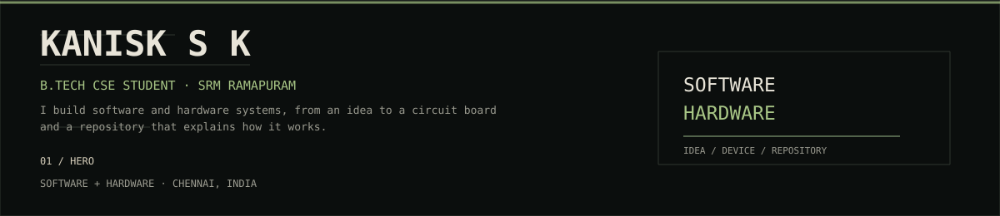
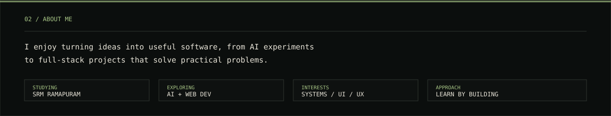
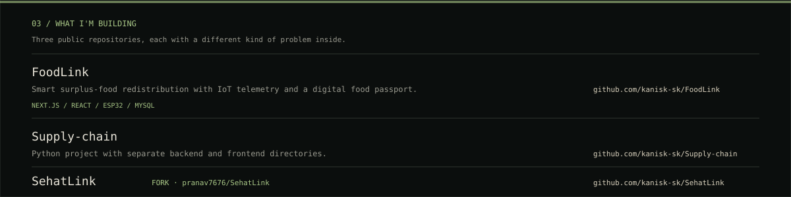
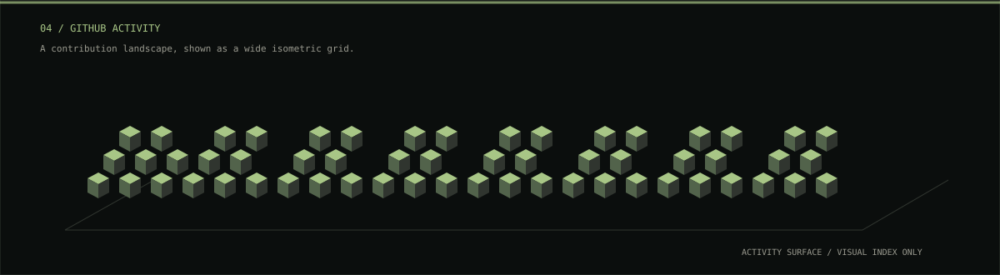
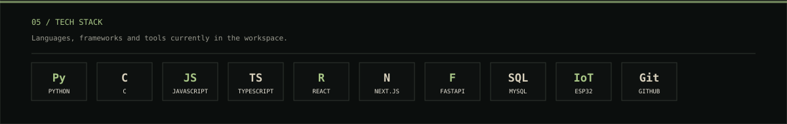
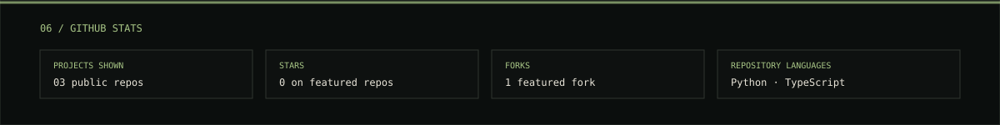
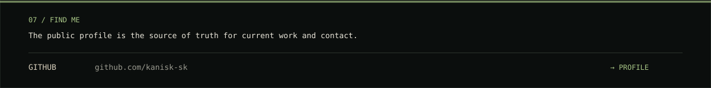

<!-- kanisk-sk profile README -->

<!-- 01 HERO -->

<!-- 02 ABOUT ME -->

<!-- 03 WHAT I'M BUILDING -->

<!-- 04 GITHUB ACTIVITY -->

<!-- 05 TECH STACK -->

<!-- 06 GITHUB STATS -->

<!-- 07 FIND ME -->

