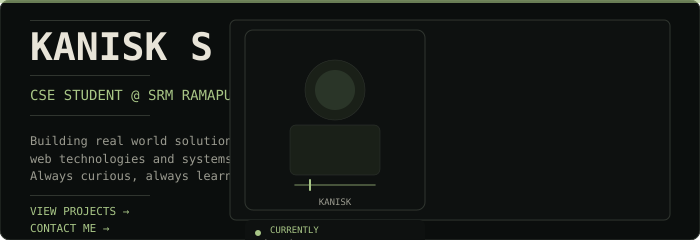
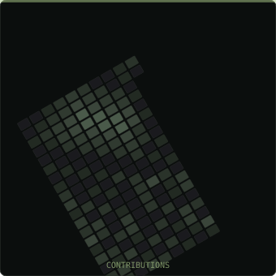
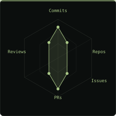
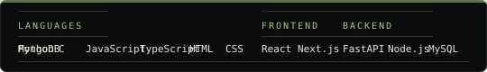
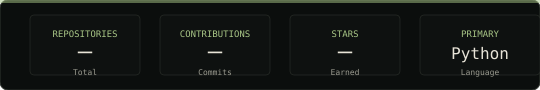
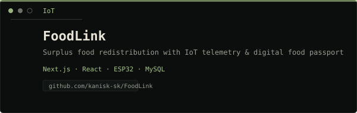
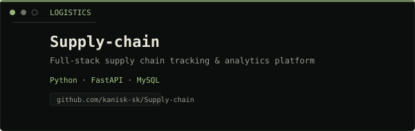
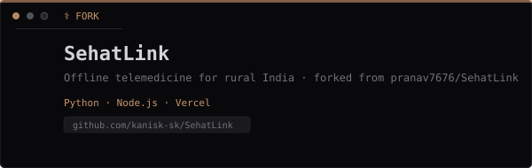

<!-- kanisk-sk profile README -->
<!-- Visual direction: Dark terminal / developer workspace -->
<!-- Palette: #0B0E0D bg, #E8E4D8 text, #A8C686 accent, #30352F borders -->

<!-- ═══════════════════════════════════════════════════════ -->
<!-- 01 — HERO                                              -->
<!-- ═══════════════════════════════════════════════════════ -->

<!-- ═══════════════════════════════════════════════════════ -->
<!-- 02 — ABOUT ME                                          -->
<!-- ═══════════════════════════════════════════════════════ -->

// 02 ABOUT ME

I'm a Computer Science student at SRM Ramapuram. I enjoy building projects that mix AI, web technologies and real world problem solving. I like exploring new tools, working on ideas from scratch and learning by doing. Currently focused on AI, full stack development and building stuff that actually solves real problems.

CSE STUDENT

SRM RAMAPURAM

LEARNING

AI + WEB DEV

INTERESTS

AI · SYSTEMS · UI/UX

GOAL

BUILD & IMPROVE

<!-- ═══════════════════════════════════════════════════════ -->
<!-- 03 — GITHUB ACTIVITY                                   -->
<!-- ═══════════════════════════════════════════════════════ -->

// 03 GITHUB ACTIVITY

CONTRIBUTION FOCUS

<!-- ═══════════════════════════════════════════════════════ -->
<!-- 04 — TECH STACK                                        -->
<!-- ═══════════════════════════════════════════════════════ -->

// 04 TECH STACK

Tools / Languages I Use

<!-- ═══════════════════════════════════════════════════════ -->
<!-- 05 — GITHUB STATS                                      -->
<!-- ═══════════════════════════════════════════════════════ -->

// 05 GITHUB STATS

<!-- ═══════════════════════════════════════════════════════ -->
<!-- PROJECTS                                               -->
<!-- ═══════════════════════════════════════════════════════ -->

// PROJECTS
SehatLink is a fork of pranav7676/SehatLink

<!-- ═══════════════════════════════════════════════════════ -->
<!-- 06 — FIND ME                                           -->
<!-- ═══════════════════════════════════════════════════════ -->

// 06 FIND ME

Let's connect and build something cool together.

Instagram →

ADD LINK

LinkedIn →

ADD LINK

Email →

ADD LINK

Building, learning and exploring, one project at a time.

— Kanisk S K

kanisk_sk · self-hosted

