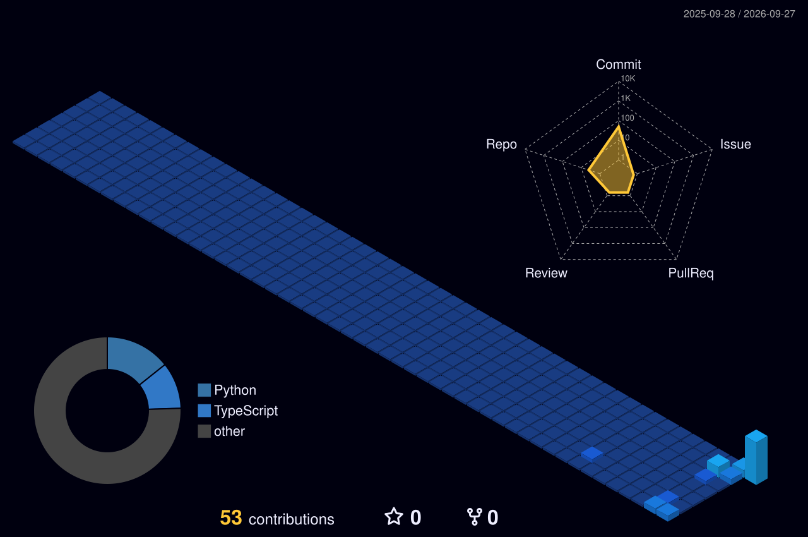

# Kanisk S K

**B.Tech CSE Student · SRM Ramapuram**
Chennai, India

 

## About Me

I'm a Computer Science student who likes finishing what I start. Most of what I build sits somewhere between AI, full-stack web development, and systems — usually because I wanted to solve a real, specific problem, not because it looked good on paper.

Co-founder of **PLUTO**, a small freelance web development studio.

Currently learning AI Engineering and Full Stack Development, targeting a Software Engineering internship by December 2026, and building toward a FAANG-level SWE role after that.

 

## Tech Stack

**Languages**

**Frontend**

**Backend / Tools**

**Others**

 

## GitHub Activity

 

## GitHub Stats

 

## Find Me

<i>Building, learning and exploring, one project at a time.</i>

