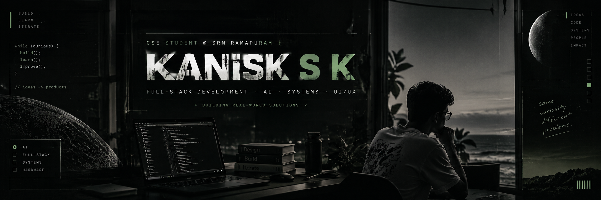

  

 

<h1 align="center">Hi, I'm Kanisk 👋</h1>

  B.Tech CSE Student · SRM Ramapuram · Chennai, India

  I build software and, sometimes, the hardware underneath it — from an idea to something that actually runs.

  <code>Full-Stack Development</code> ·
  <code>AI</code> ·
  <code>Systems</code> ·
  <code>UI/UX</code>

  

---

<h2>🧠 About Me</h2>

<table width="100%">
<tr>

<td width="65%" valign="top">

I’m **Kanisk SK**, a CSE student at **SRM Institute of Science and Technology**, building things across **AI, full-stack development, and backend systems**.

I like taking ideas from a rough concept to something that actually works — whether it’s an AI assistant, a supply-chain platform, or a hardware prototype.

Currently exploring **Python, JavaScript, AI/ML, backend engineering, and system design**.

</td>

<td width="35%" valign="top">

<pre>
IDEAS
  ↓
BUILD
  ↓
BREAK
  ↓
DEBUG
  ↓
IMPROVE
  ↓
SHIP
</pre>

</td>

</tr>
</table>

---

<h2>🧰 Tech Stack</h2>

<table width="100%">
<tr>

<td width="25%" valign="top">

<h3>Languages</h3>

</td>

<td width="25%" valign="top">

<h3>Frontend</h3>

</td>

<td width="35%" valign="top">

<h3>Backend / Tools</h3>

</td>

<td width="15%" valign="top">

<h3>Others</h3>

</td>

</tr>
</table>

---

<h2>📊 GitHub Stats</h2>

<table width="90%">
<tr>

<td align="center" width="33%">

<h1>81</h1>

<h3>Total Contributions</h3>

May 6, 2025 - Present

</td>

<td align="center" width="33%">

<h1>🔥 0</h1>

<h3>Current Streak</h3>

 

Sep 26

</td>

<td align="center" width="33%">

<h1>6</h1>

<h3>Longest Streak</h3>

 

Sep 16 - Sep 21

</td>

</tr>
</table>

---

<h2>📈 GitHub Activity</h2>

---

<h2>🚀 Featured Projects</h2>

<table width="100%">
<tr>

<td width="33%" valign="top">

<h3>🔗 SehatLink</h3>

Healthcare appointment platform focused on easier access and management.

<code>TypeScript</code>

<a href="https://github.com/kanisk-sk/SehatLink">
View Repository →
</a>

</td>

<td width="33%" valign="top">

<h3>🍱 FoodLink</h3>

Smart surplus-food redistribution system with IoT telemetry and Digital Food Passport.

<code>TypeScript</code> · <code>ESP32</code>

<a href="https://github.com/kanisk-sk/FoodLink">
View Repository →
</a>

</td>

<td width="33%" valign="top">

<h3>📦 Supply-chain</h3>

Supply Chain Tracking & Analytics system with inventory, orders, shipments and alerts.

<code>Python</code> · <code>FastAPI</code>

<a href="https://github.com/kanisk-sk/Supply-chain">
View Repository →
</a>

</td>

</tr>
</table>

---

<h2>🔬 Currently Exploring</h2>

<table width="100%">
<tr>

<td width="50%" valign="top">

<h3>🤖 AI Engineering</h3>

AI assistants, local models, RAG pipelines, voice interaction and AI-powered applications.

</td>

<td width="50%" valign="top">

<h3>⚙️ Backend Engineering</h3>

APIs, databases, authentication, analytics, schedulers and backend architecture.

</td>

</tr>

<tr>

<td width="50%" valign="top">

<h3>🌐 Full-Stack Development</h3>

Building complete applications across frontend, backend and database layers.

</td>

<td width="50%" valign="top">

<h3>🔌 Hardware + IoT</h3>

Experimenting with ESP32, sensors, telemetry and software dashboards.

</td>

</tr>
</table>

---

<h2>🤝 Find Me</h2>

  Let's connect and build something cool together.

  
  &nbsp;
  
  &nbsp;
  

 

  <i>Building, learning and exploring, one project at a time.</i>

