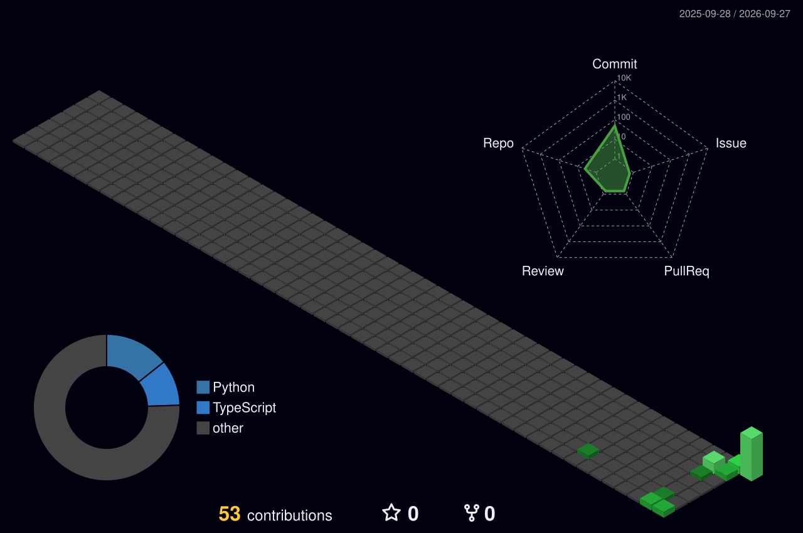

<h1 align="center">Hi, I'm Kanisk 👋</h1>

B.Tech CSE Student · SRM Ramapuram · Chennai, India

I build software and, sometimes, the hardware underneath it — from an idea to something that actually runs.

<code>Full-Stack Development</code> ·
<code>AI</code> ·
<code>Systems</code> ·
<code>UI/UX</code>

  

---

### 🧠 About Me

I’m **Kanisk SK**, a CSE student at SRM Institute of Science and Technology, building things across **AI, full-stack development, and backend systems**.

I like taking ideas from a rough concept to something that actually works — whether it’s an AI assistant, a supply-chain platform, or a hardware prototype.

Currently exploring **Python, JavaScript, AI/ML, backend engineering, and system design**.
---

### 🧰 Tech Stack

**Languages**

**Frontend**

**Backend / Tools**

**Others**

---

### 📊 GitHub Stats

<table width="90%">
<tr>

<td align="center" width="33%">

<h1>81</h1>

<h3>Total Contributions</h3>

May 6, 2025 - Present

</td>

<td align="center" width="33%">

<h1>🔥 0</h1>

<h3>Current Streak</h3>

 

Sep 26

</td>

<td align="center" width="33%">

<h1>6</h1>

<h3>Longest Streak</h3>

 

Sep 16 - Sep 21

</td>

</tr>
</table>

---

### 📈 GitHub Activity

---

### 🤝 Find Me

Let's connect and build something cool together.

<i>Building, learning and exploring, one project at a time.</i>

